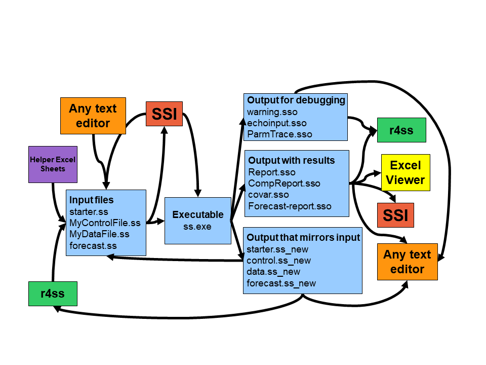
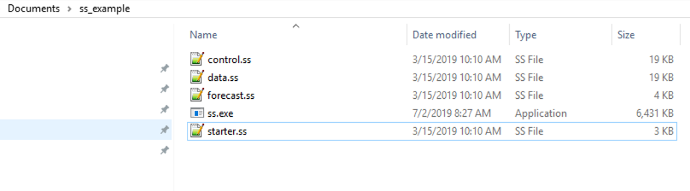
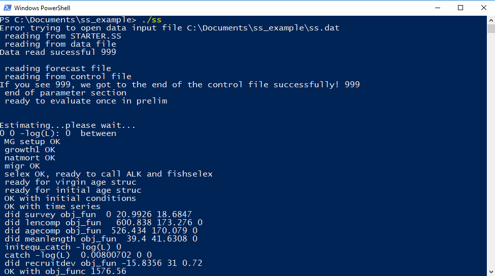
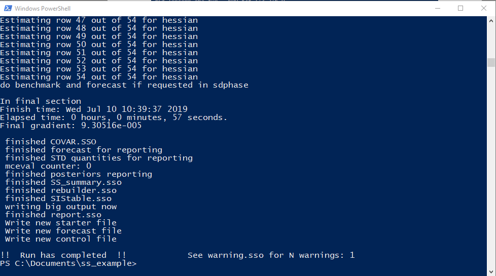
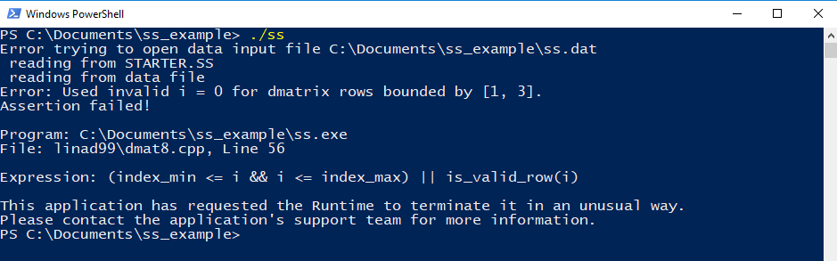

```{r setup, include=FALSE}
knitr::opts_chunk$set(echo = TRUE)
```
# Scope

Stock Synthesis (SS3) is a statistical fisheries population dynamics modeling framework built in [AD Model Builder](http://www.admb-project.org/). This Getting Started Guide introduces users to running SS3. We assume some experience with population dynamics models and a basic understanding of how to use the command line.

If you have never used the command line, please see the resources in [Appendix 1](#app1).

To follow along, we recommend downloading the [simple example](https://github.com/nmfs-stock-synthesis/user-examples/tree/main/model_files/simple) ([Instructions for downloading](https://github.com/nmfs-stock-synthesis/user-examples#how-to-download)) and the [latest release of SS3](https://github.com/nmfs-stock-synthesis/stock-synthesis/releases/latest). Simple is a working SS3 model that runs in less than three minutes and should allow you to experiment with SS3 workflows without having to worry about the model’s contents.

By the end of using this guide, you should:

1. Understand the input and output file structure for SS3
2. Be able to run an SS3 model via the command line
3. Understand which tools are available to work with SS3 models
4. Troubleshoot basic problems associated with running an SS3 model

```{r, echo = FALSE, out.width = "450px", fig.cap="Figure 1. SS3 input and output files, and associated tools. Note that some tools are used with both input and output model files."}

```

# Stock Synthesis file structures and tools

SS3 uses text input files and produces text output files. In this section, the SS3 input and output files are described, as are tools that can be used with these files. See how they relate in Figure 1.

## SS3 files: Required inputs

Four required input files are read by the SS3 executable. Throughout this document, we will refer to the SS3 executable as ss3.exe. Keep in mind that the Linux and Mac versions of SS3 have no file extension (e.g., ss3), and the executable can be renamed by the user as desired (e.g.,ss3.exe, ss_win.exe, ss_3.30.18.exe). These input files are:

 1. **starter.ss:** Required file containing file names of the data file and the control file plus other run controls. Must be named starter.ss.
 2. **data file:** File containing model dimensions and the data. The data file can have any name, as specified in the starter file, but typically ends in .ss or .dat.
 3. **control file:** File containing set-up for the parameters. The control file can have any name, as specified in the starter file, but typically ends in .ss or .ctl.
 4. **forecast.ss:** File containing specifications for reference points and forecasts. Must be named forecast.ss.
 
## SS3 files: Optional inputs

The two optional input files for SS3 are:

 1. **ss.par:** A text file with one line per parameter where order matters. Usually created from a previous model run. This file can provide initial parameter values instead of using the initial values in the control file. The option to use the ss.par file or the control file for initial parameter values is selected in starter.ss.
 2. **wtatage.ss:** File containing empirical input of body weight by fleet and population and empirical fecundity-at-age. The option to use the wtatage.ss file is selected in a line of the control file.

## SS3 output files

Many output text files are created during a model run. The most useful output files can be divided into:

 1. **Files containing results**. These files include ss_summary.sso and report.sso that contain model results summarized in different ways. 
 2. **.ss_new files**. These files echo the SS3 input files, but include standardized comments. The values should be the same as the input files, except for control.ss_new, which updates the initial values to the final estimated values. The .ss_new files can be useful to standardize comments in the input files and can be checked to make sure that SS3 interpreted the inputs as the user intended.
 3. **Files used for debugging**. These files include warnings.sso and echoinput.sso.

## Tool definitions

+ **Any text editor** can be used to view and edit SS3 input and output files. Defining a custom syntax highlighting scheme for SS3 files may improve SS3 file readability. Some commonly used text editors include Atom, Emacs, Notepad++, and Sublime Text.

+ **r4ss**: An R package to plot SS3 model results and manipulate SS3 input and output files. Available at: https://github.com/r4ss/r4ss

+ **SSI**: Stock Synthesis Interface (i.e., the SS3 GUI). The [latest version of SSI](https://github.com/nmfs-stock-synthesis/ssi/releases/latest) can be downloaded from GitHub. SSI can be used to edit, save, run, and visualize model inputs and outputs. Note that SSI is not maintained for Stock Synthesis versions after v.3.30.21.

+ **Stock Assessment Continuum Tool**: Available through github at https://github.com/shcaba/SS-DL-tool, the Stock Assessment Continuum Tool (previously known as the Stock Synthesis Data-limited Tool) is a Shiny-based application that provides an interface to upload catch time-series, age composition, length composition, and abundance index data and define model options within the application, which then writes the Stock Synthesis input files.

# Running SS3

SS3 is typically run through the command line (although it can also be run indirctly via the commandline through an R console). We will introduce the one folder approach, where SS3 is in the same folder as the model files. Other possible approaches to running SS3 include, which are detailed in the ["Running Stock Synthesis" section of the user manual](https://nmfs-stock-synthesis.github.io/doc/SS330_User_Manual.html#sec:RunningSS3).

## The one folder approach and demonstration of an SS3 model run

The one folder approach is so named because the model input files and SS3 executable are in the same folder. The one folder approach is the simplest way to run SS3 via the command line, so we will walk through an example run using this approach.

### Setup for the 1 folder approach

Create a folder and add:

+ Control File (Must match name in starter.ss)
+ Data File (Must match name in starter.ss)
+ forecast.ss
+ ss3.exe
+ starter.ss
+ Conditional files: wtatage.ss (if doing empirical wt-at-age approach) and/or ss.par (to continue from a previous run)

For example, here is what should be included for a model with no conditional files (where the control and data file names specified in starter.ss are control.ss and data.ss, respectively):



### Run SS3

Once all of the model files and the SS3 executable are in the same folder, you can open your command window of choice at the location of the model files. 

To do this, you can typically click to highlight the folder the model files are in, then  shift + right click on the same folder and select the option from the menu to open the command line of choice (e.g., Windows Powershell). This should bring up a command window. Then, type `ss3` (or other name of the ss3 exe) into the command prompt and hit enter. Note that if you are using Windows Powershell, you will need to type `./ss3`.

The exact instructions for running SS3 can differ depending on the command window used. If you have trouble, search for resources that describe running an executable for your specific command line.

If you still have issues, double-check that you are calling the correct exe name (e.g., you would need to type `ss_win` to run an executable called `ss_win.exe`.) and that the command line has the correct directory.

After starting the run, you should see output to the command line similar to:



If the output gets past `Estimating…please wait…`, then the structure of the SS3 inputs is correct. The volume of information displayed during the run within the command window is controlled in starter.ss file on the line with the comment `# run display detail (0,1,2)`. The 0 setting is the least verbose option, while the 2 setting is the most verbose.

SS3 always opens and reads files in the same order (starter.ss,  data file, forecast.ss, control, then wtatage.ss if using, and finally ss.par if using), writing to echoinput.sso (a file for debugging runs) and warnings.sso (a file which collects warnings from SS3) as it reads. SS3 inputs are read in order by value, without reference to comments (i.e., anything after `#` on a line). Linebreaks and whitespace are both treated as separators. Depending on which options are selected, SS3 will expect a particular number of values in a certain order, so failing to provide them will result in errors or at least a different model specification than intended.

After reading, SS3 proceeds immediately to pre-processing the data and creating internal parameter labels. As SS3 executes, it continues to write debugging output to echoinput.sso and warnings to warnings.sso.

SS3 next goes to the procedure section where iterative parameter changes are made by ADMB to minimize the negative log likelihood. When ADMB achieves convergence, control passes to the sd_phase for calculation of parameter variance (unless `–nohess` option is specified; See [command line options](#options)). After the sd_phase, SS3 proceeds to the benchmark and forecast code section and then to final reporting. Output files containing results are typically written to the directory in which the model was run from (except when using [this special subfolder option](https://nmfs-stock-synthesis.github.io/doc/SS330_User_Manual.html#optional-output-subfolders)).

When the run completes, SS3 shows `!! Run has completed !!` and the number of warnings:


Examine warnings.sso for issues and suggestions, regardless of if the run completed successfully or not. If SS3 exits on error, you will not see the message `!! Run has completed !!`. Here is an example of a run that exited on error due to invalid inputs: 



### Examine the output

**.ss_new files** are generated if a model run completes. For more information on the .ss_new files, see the ["Output Files" section of the SS3 user manual](https://nmfs-stock-synthesis.github.io/doc/SS330_User_Manual.html#output-files).

**ss_summary.sso** files are included with the examples on vlab so that you can compare it with the `ss_summary.sso` file generated by your model run. You should see similar if not exactly the same values for the likelihood and parameter values if using the same version of SS3.

Output from SS3 can be read into [r4ss](https://github.com/r4ss/r4ss) or the excel viewer.

# Options for running SS3

## Command line options {#options}

ADMB options can be added to the run when calling the SS3 executable from the command line. The most commonly used option is `ss3 -nohess` to skip standard errors (for quicker  results or to get Report.sso if the hessian does not invert).

To list all command line options, use one of these calls: `SS3 -?` or `SS3 -help`. More info about the ADMB command line options is available in the [ADMB Manual](http://www.admb-project.org/docs/manuals/) (Chapter 12: Command line options).

To run SS3 without estimation use: `ss3 -stopph 0`. This will speed up your run by not optimizing. Often `-stopph 0` is used with the `-nohess` option to speed up the run even more. To run SS3 with no estimation in v.3.30.15 and earlier, change the max phase in the starter.ss file to 0 and run the exe with the `–nohess` option.

## Using ss.par for initial values

Typically, SS3 uses initial parameter values as specified in the parameter lines of the control file. However, initial values can be read from the ss.par file instead.
To use ss.par, in starter.ss below the names of the data and control files, set the value to 1 rather than 0 on the line with comment: 

`# 0=use init values in control file; 1=use ss.par`.

Using the ss.par file is helpful when you want to use different initial values without modifying the control file. An ss.par file is an output file created during each model run and contains the ending parameter values. Using this ss.par file from a previous model run with a similar model (that still has the same parameters) will speed up run time because the initial values are likely closer to the maximum likelihood estimation (MLE) parameter estimates.

## Using wtatage.ss

As stated in the manual, SS3 has the capability to read empirical body weight at age for the population and each fleet, in lieu of generating these weights internally from the growth parameters, weight-at-length, and size-selectivity. Please see the [Empirical Weight-at-Age (wtatage.ss) section of the SS3 user manual](https://nmfs-stock-synthesis.github.io/doc/SS330_User_Manual.html#WAA) for more information on using wtatage.ss with a model. There is also a [weight at age SS3 example model available](https://github.com/nmfs-stock-synthesis/user-examples/tree/main/model_files/empirical_wtatage_and_age_selex) if you would like to try using this feature without having to build your own model.

# Plotting results and basic troubleshooting

## Using r4ss to organize and plot SS3 output

To plot the results of an SS3 model after it has run, use:
```{r r4ss, eval = FALSE}
library(r4ss) # use r4ss package on github
# create list of quantities for the model in the directory mydir
replist <- SS_output(mydir)
SS_plots(replist)# create plots for SS3 run
```
See https://github.com/r4ss/r4ss for {r4ss} installation instructions. r4ss includes other functionality for working with SS3 models, see the [r4ss vignette](https://r4ss.github.io/r4ss/vignettes/r4ss-intro-vignette.html) for an introduction.

## What to do when SS3 doesn't run

Here are some basic checks for when SS3 does not run:

 + Make sure that all files and directories are named correctly.
 + Check that starter.ss references the correct names of the control and data files.
 + If SS3 starts to read files and then crashes, check warnings.sso and echoinput.sso. The warnings.sso will reveal potential issues with the model, while echoinput.sso will show how far SS3 was able to run. Work backwards from the bottom of echoinput.sso, looking for where SS3 stopped and if the inputs are being read corectly or not.

For further information on troubleshooting, please refer to the SS3 User Manual [“Running Stock Synthesis” subsections](https://nmfs-stock-synthesis.github.io/doc/SS330_User_Manual.html#sec:RunningSS3), especially [“Re-Starting a Run”](https://nmfs-stock-synthesis.github.io/doc/SS330_User_Manual.html#re-starting-a-run) and  [“Debugging Tips”](https://nmfs-stock-synthesis.github.io/doc/SS330_User_Manual.html#debugging-tips).

# Where to get additional help

+ Post to the Stock Synthesis [discussion boards on GitHub](https://github.com/nmfs-stock-synthesis/stock-synthesis/discussions)
+ The [SS3 vlab website](https://vlab.noaa.gov/web/stock-synthesis) resources, including the SS3 user manual and the SSI user guide
+ Post questions to the [forums](https://vlab.noaa.gov/web/stock-synthesis/public-forums)
+ Email questions to nmfs.stock.synthesis@noaa.gov
+ Report bugs or request features using the [Stock Synthesis issue tracker](https://github.com/nmfs-stock-synthesis/stock-synthesis/issues)
+ [Fisheries Research special issue (vol. 142) on Stock Synthesis](https://www.sciencedirect.com/journal/fisheries-research/vol/142/suppl/C)
+ [Center for the Advancement of Population Assessment Methodology (CAPAM)](http://www.capamresearch.org/) provides information about good practices in stock assessment

# Appendix 1: An introduction to the command line {#app1}

If you have never used the command line before, it will be helpful to learn a few basics. Some potential resources include:

 + [Appendix A](https://happygitwithr.com/shell.html) to the Happy Git and GitHub for the useR book, which introduces the command line on Linux, OSX, and Windows systems.
 + [Introduction to the Command Line by Launch School](https://launchschool.com/books/command_line) has even more detail about using the command line specifically on Linux (which should also apply to OSX systems)
 + A web search on "Command Line" will reveal plenty of other resources
